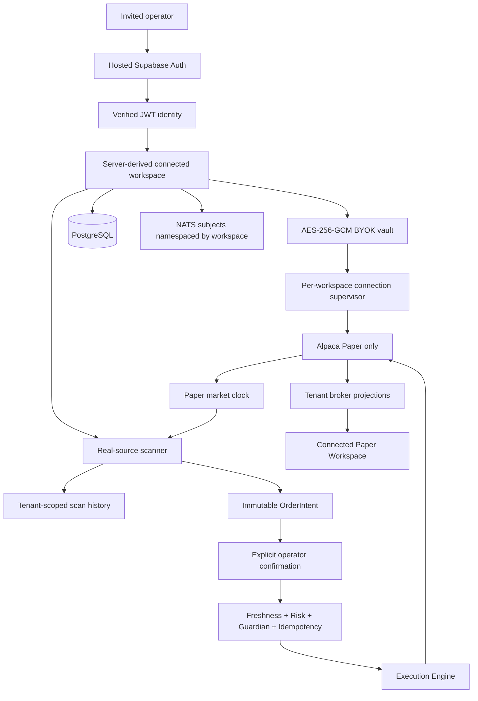

# AlphaDesk Connected Paper architecture

## Security boundaries

- Runtime exposes only authenticated Connected Paper operator workflows; the public demo router and session startup are not mounted.
- Connected routes require a valid Supabase JWT. The API derives the workspace from the authenticated subject and never accepts a tenant ID from the browser.
- Operator Alpaca and AI-provider secrets are write-only, encrypted with unique nonces and tenant-bound associated data, and stored only in AlphaDesk PostgreSQL.
- Supabase's server secret is available only to the API. The worker receives an explicit empty override and the browser receives only public Supabase configuration.
- The worker decrypts a credential only in memory and supervises each workspace independently.
- Manual and scheduled scans create workspace-scoped scan-run records. Opportunity rows retain real-source timestamps and provenance.
- Only the Execution Engine submits orders. Every order is bound to the persisted PAPER/LIVE environment, matching account and credentials, stable client-order ID, immutable approval, Guardian, reconciliation, and submission-fencing checks. LIVE is two-phase: an admin may prepare a separately verified target while remaining PAPER, then Enable LIVE revalidates fresh preparation and confirmation. The persisted LIVE worker must independently establish trade-updates and reconciliation readiness before execution; preparation never fakes stream connectivity.
- PostgreSQL and NATS have no published ports in the Lightsail Compose file. Caddy is the only public ingress.

The historical demo-session migration and model are retained so existing databases are not altered destructively; they are not reachable through the application runtime.
